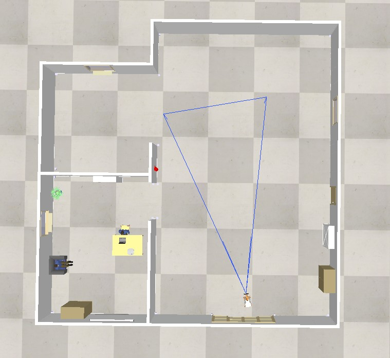
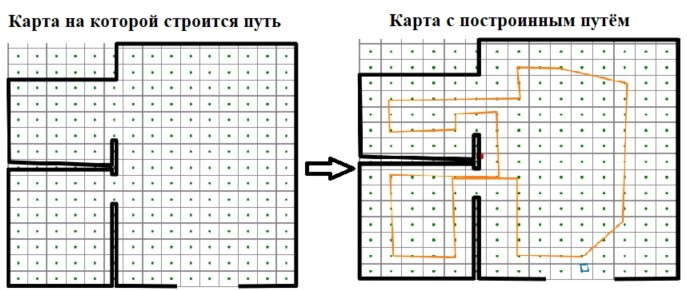

<h1 aligh="center">CoppeliaSim_Youbot</h1>
<h3 align="center">cartography and path building in the sphere of coppéliaSim using primitive shape</h3>

The code allows you to build a map in the coppeliasim environment and discretize it with a given step. 
In addition, you can build a path using a given point by clicking the mouse.

The result of the program

